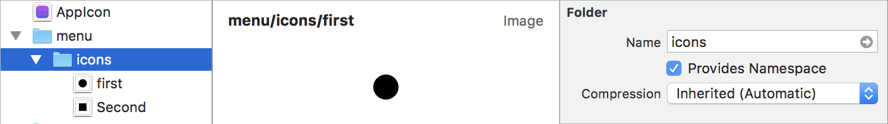

# Examples

On this page you'll find examples of the kind of resources R.swift supports and how you can use them. We aim to keep this page up to date and complete so this should be a overview of all possibilities.

## Runtime validation

Call `R.validate()` to call all validation methods that R.swift generates, this will check:
- If all images used in storyboards and nibs are available
- If all view controllers with storyboard identifiers can be loaded
- If all custom fonts can be loaded

The `R.validate()` method will throw a detailed error about the problems that occur. Note that this method will always perform checks, even in release builds. It’s recommended that validation is done in a testcase.

*Example testcase*
```swift
do {
  try R.validate()
} catch {
	XCTFail(error)
}
```

## Images

R.swift will find both images from Asset Catalogs and image files in your bundle.

*Vanilla*
```swift
let settingsIcon = UIImage(named: "settings-icon")
let gradientBackground = UIImage(named: "gradient.jpg")
```

*With R.swift*
```swift
let settingsIcon = R.image.settingsIcon()
let gradientBackground = R.image.gradientJpg()
```

### Support for assets grouped in folders

Selecting "Provides Namespace" results in grouping assets:



Use like so:
```swift
let image = R.image.menu.icons.first()
```

## Custom fonts

*Vanilla*
```swift
let lightFontTitle = UIFont(name: "Acme-Light", size: 22)
```

*With R.swift*
```swift
let lightFontTitle = R.font.acmeLight(size: 22)
```

**Tip:** Also want this for system fonts? Take a look at the [UIFontComplete](https://github.com/Nirma/UIFontComplete) library, has a similar solution for the fonts Apple ships with iOS.

## Resource files

*Vanilla*
```swift
let jsonURL = Bundle.main.url(forResource: "seed-data", withExtension: "json")
let jsonPath = Bundle.main.path(forResource: "seed-data", ofType: "json")
```

*With R.swift*
```swift
let jsonURL = R.file.seedDataJson()
let jsonPath = R.file.seedDataJson.path()
```

## Colors

*Vanilla*
```swift
label.backgroundColor = UIColor(red: 0.9, green: 0.9, blue: 0.9, alpha: 0.5)
label.textColor = UIColor(red: 0.3, green: 0.3, blue: 0.3, alpha: 1.0)
```

*With R.swift*
```swift
// Colors are extracted from the *.clr files that are in your Xcode project
label.backgroundColor = R.color.appColors.backgroundColor()
label.textColor = R.color.appColors.textColor()
```

There are some points to keep in mind when using Color palettes, see [About Colors](Colors.md)

## Localized strings

*Vanilla*
```swift
let welcomeMessage = NSLocalizedString("welcome.message", comment: "")
let settingsTitle = NSLocalizedString("title", tableName: "Settings", comment: "")

// Formatted strings
let welcomeName = String(format: NSLocalizedString("welcome.withName", comment: ""), locale: NSLocale.current, "Alice")

// Stringsdict files
let progress = String(format: NSLocalizedString("copy.progress", comment: ""), locale: NSLocale.current, 4, 23)
```

*With R.swift*
```swift
// Localized strings are grouped per table (.strings file)
let welcomeMessage = R.string.localizable.welcomeMessage()
let settingsTitle = R.string.settings.title()

// Functions with parameters are generated for format strings
let welcomeName = R.string.localizable.welcomeWithName("Alice")

// Functions with named argument labels are generated for stringsdict keys
let progress = R.string.localizable.copyProgress(completed: 4, total: 23)
```

## Storyboards

*Vanilla*
```swift
let storyboard = UIStoryboard(name: "Main", bundle: nil)
let initialTabBarController = storyboard.instantiateInitialViewController() as? UITabBarController
let settingsController = storyboard.instantiateViewController(withIdentifier: "settingsController") as? SettingsControllerSettingsController
```

*With R.swift*
```swift
let storyboard = R.storyboard.main()
let initialTabBarController = R.storyboard.main.initialViewController()
let settingsController = R.storyboard.main.settingsController()
```

## Segues

*Vanilla*
```swift
// Trigger segue with:
performSegue(withIdentifier: "openSettings", sender: self)

// And then prepare it:
override func prepare(for segue: UIStoryboardSegue, sender: Any?) {
    if let settingsController = segue.destination as? SettingsController,
       let segue = segue as? CustomSettingsSegue, segue.identifier == "openSettings" {
      segue.animationType = .LockAnimation
      settingsController.lockSettings = true
    }
  }
```

*With R.swift*
```swift
// Trigger segue with:
performSegue(withIdentifier: R.segue.overviewController.openSettings, sender: self)

// And then prepare it:
override func prepare(for segue: UIStoryboardSegue, sender: Any?) {
  if let typedInfo = R.segue.overviewController.openSettings(segue: segue) {
    typedInfo.segue.animationType = .LockAnimation
    typedInfo.destinationViewController.lockSettings = true
  }
}
```

**Tip:** Take a look at the [SegueManager](https://github.com/tomlokhorst/SegueManager) library, it makes segues block based and is compatible with R.swift.

## Nibs

*Vanilla*
```swift
let nameOfNib = "CustomView"
let customViewNib = UINib(nibName: "CustomView", bundle: nil)
let rootViews = customViewNib.instantiate(withOwner: nil, options: nil)
let customView = rootViews[0] as? CustomView

let viewControllerWithNib = CustomViewController(nibName: "CustomView", bundle: nil)
```

*With R.swift*
```swift
let nameOfNib = R.nib.customView.name
let customViewNib = R.nib.customView()
let rootViews = R.nib.customView.instantiate(withOwner: nil)
let customView = R.nib.customView.firstView(owner: nil)

let viewControllerWithNib = CustomViewController(nib: R.nib.customView)
```

## Reusable table view cells

*Vanilla*
```swift
class FaqAnswerController: UITableViewController {
  override func viewDidLoad() {
    super.viewDidLoad()
    let textCellNib = UINib(nibName: "TextCell", bundle: nil)
    tableView.register(textCellNib, forCellReuseIdentifier: "TextCellIdentifier")
  }

  override func tableView(_ tableView: UITableView, cellForRowAt indexPath: IndexPath) -> UITableViewCell {
    let textCell = tableView.dequeueReusableCell(withIdentifier: "TextCellIdentifier", for: indexPath) as! TextCell
    textCell.mainLabel.text = "Hello World"
    return textCell
  }
}
```

*With R.swift*

On your reusable cell Interface Builder "Attributes" inspector panel, set the cell "Identifier" field to the same value you are going to register and dequeue.

```swift
class FaqAnswerController: UITableViewController {
  override func viewDidLoad() {
    super.viewDidLoad()
    tableView.register(R.nib.textCell)
  }

  override func tableView(_ tableView: UITableView, cellForRowAt indexPath: IndexPath) -> UITableViewCell {
    let textCell = tableView.dequeueReusableCell(withIdentifier: R.nib.textCell.identifier, for: indexPath)!
    textCell.mainLabel.text = "Hello World"
    return textCell
  }
}
```

## Reusable collection view cells

*Vanilla*
```swift
class RecentsController: UICollectionViewController {
  override func viewDidLoad() {
    super.viewDidLoad()
    let talkCellNib = UINib(nibName: "TalkCell", bundle: nil)
    collectionView?.register(talkCellNib, forCellWithReuseIdentifier: "TalkCellIdentifier")
  }

  override func collectionView(_ collectionView: UICollectionView, cellForItemAt indexPath: IndexPath) -> UICollectionViewCell {
    let cell = collectionView.dequeueReusableCell(withReuseIdentifier: "TalkCellIdentifier", for: indexPath) as! TalkCell
    cell.configureCell("Item \(indexPath.item)")
    return cell
  }
}
```

*With R.swift*

On your reusable cell Interface Builder "Attributes" inspector panel, set the cell "Identifier" field to the same value you are going to register and dequeue.

```swift
class RecentsController: UICollectionViewController {
  override func viewDidLoad() {
    super.viewDidLoad()
    collectionView?.register(R.nib.talkCell)
  }

  override func collectionView(_ collectionView: UICollectionView, cellForItemAt indexPath: IndexPath) -> UICollectionViewCell {
    let cell = collectionView.dequeueReusableCell(withReuseIdentifier: R.reuseIdentifier.talkCell, for: indexPath)!
    cell.configureCell("Item \(indexPath.item)")
    return cell
  }
}
```
