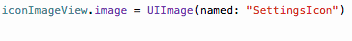

# R.swift [](http://cocoapods.org/?q=R.swift) [](blob/master/License)  

_Get strong typed, autocompleted resources like images, fonts and segues in Swift projects_

## Why use this?

It makes your code that uses resources:
- **Fully typed**, less casting and guessing what a method will return
- **Compile time checked**, no more incorrect strings that make your app crash at runtime
- **Autocompleted**, never have to guess that image name again

Currently you type:
```swift
let icon = UIImage(named: "settings-icon")
let font = UIFont(name: "San Francisco", size: 42)
let viewController = CustomViewController(nibName: "CustomView", bundle: nil)
let string = String(format: NSLocalizedString("welcome.withName", comment: ""), locale: NSLocale.current, "Arthur Dent")
```

With R.swift it becomes:
```swift
let icon = R.image.settingsIcon()
let font = R.font.sanFrancisco(size: 42)
let viewController = CustomViewController(nib: R.nib.customView)
let string = R.string.localizable.welcomeWithName("Arthur Dent")
```

Check out [more examples](Documentation/Examples.md) or hear about [how Fabric.app uses R.swift](https://realm.io/news/slug-javi-soto-building-fabric-in-swift/#rswift-2956javascriptpresentzchangechapter053true)!

## Demo

**Autocompleted images:**



**Compiletime checked images:**


This is only the beginning, check out [more examples](Documentation/Examples.md)!

## Features

After installing R.swift into your project you can use the `R`-struct to access resources. If the struct is outdated just build and R.swift will correct any missing/changed/added resources.

R.swift currently supports these types of resources:
- [Images](Documentation/Examples.md#images)
- [Custom fonts](Documentation/Examples.md#custom-fonts)
- [Resource files](Documentation/Examples.md#resource-files)
- [Colors](Documentation/Examples.md#colors)
- [Localized strings](Documentation/Examples.md#localized-strings)
- [Storyboards](Documentation/Examples.md#storyboards)
- [Segues](Documentation/Examples.md#segues)
- [Nibs](Documentation/Examples.md#nibs)
- [Reusable cells](Documentation/Examples.md#reusable-table-view-cells)

Runtime validation with [`R.validate()`](Documentation/Examples.md#runtime-validation):
- If all images used in storyboards and nibs are available
- If all view controllers with storyboard identifiers can be loaded
- If all custom fonts can be loaded

## Q&A

- [Why was R.swift created?](Documentation/QandA.md#why-was-rswift-created)
- [Why should I choose R.swift over alternative X or Y?](Documentation/QandA.md#why-should-i-choose-rswift-over-alternative-x-or-y)
- [What are the requirements to run R.swift?](Documentation/QandA.md#what-are-the-requirements-to-run-rswift)
- [How to use methods with a `Void` argument?](Documentation/QandA.md#how-to-use-methods-with-a-void-argument)
- [How to fix missing imports in the generated file?](Documentation/QandA.md#how-to-fix-missing-imports-in-the-generated-file)
- [How to use classes with the same name as their module?](Documentation/QandA.md#how-to-use-classes-with-the-same-name-as-their-module)
- [Can I ignore resources?](Documentation/Ignoring.md)
- [Can I use R.swift in a library?](Documentation/QandA.md#can-i-use-rswift-in-a-library)
- [How does R.swift work?](Documentation/QandA.md#how-does-rswift-work)
- [How to upgrade to a new major version?](Documentation/Migration.md)

## Installation

[CocoaPods](http://cocoapods.org) is the recommended way of installation, as this avoids including any binary files into your project.

_Note on Carthage: R.swift is a tool that used in a build step, it is not a dynamic library. Therefore [it is not possible](https://github.com/mac-cain13/R.swift/issues/42) to install it with Carthage._

### CocoaPods (recommended)

_There is also a [short video](https://vimeo.com/122888912) of this instruction._

1. Add `pod 'R.swift'` to your [Podfile](http://cocoapods.org/#get_started) and run `pod install`
2. In Xcode: Click on your project in the file list, choose your target under `TARGETS`, click the `Build Phases` tab and add a `New Run Script Phase` by clicking the little plus icon in the top left
3. Drag the new `Run Script` phase **above** the `Compile Sources` phase and **below** `Check Pods Manifest.lock`, expand it and paste the following script: `"$PODS_ROOT/R.swift/rswift" "$SRCROOT"`
4. Build your project, in Finder you will now see a `R.generated.swift` in the `$SRCROOT`-folder, drag the `R.generated.swift` files into your project and **uncheck** `Copy items if needed`

_Tip:_ Add the `*.generated.swift` pattern to your `.gitignore` file to prevent unnecessary conflicts.

### Manually

0. Add the [R.swift.Library](https://github.com/mac-cain13/R.swift.Library#Installation) to your project
1. [Download](https://github.com/mac-cain13/R.swift/releases) a R.swift release, unzip it and put it into your source root directory
2. In Xcode: Click on your project in the file list, choose your target under `TARGETS`, click the `Build Phases` tab and add a `New Run Script Phase` by clicking the little plus icon in the top left
3. Drag the new `Run Script` phase **above** the `Compile Sources` phase, expand it and paste the following script: `"$SRCROOT/rswift" "$SRCROOT"`
4. Build your project, in Finder you will now see a `R.generated.swift` in the `$SRCROOT`-folder, drag the `R.generated.swift` files into your project and **uncheck** `Copy items if needed`

_Tip:_ Add the `*.generated.swift` pattern to your `.gitignore` file to prevent unnecessary conflicts.

### Building from source

R.swift is build using [Swift Package Manager (SPM)](https://github.com/apple/swift-package-manager).

To create a development build of R.swift, check out the code and run `swift build` from the root directory.  
To create a release build, run `swift build -c release -Xswiftc -static-stdlib` to statically link the Swift standard library.

## Contribute

We'll love contributions, read the [contribute docs](Documentation/Contribute.md) for info on how to report issues, submit ideas and submit pull requests!

## License

[R.swift](https://github.com/mac-cain13/R.swift) and [R.swift.Library](https://github.com/mac-cain13/R.swift.Library) are created by [Mathijs Kadijk](https://github.com/mac-cain13) and released under a [MIT License](License).
